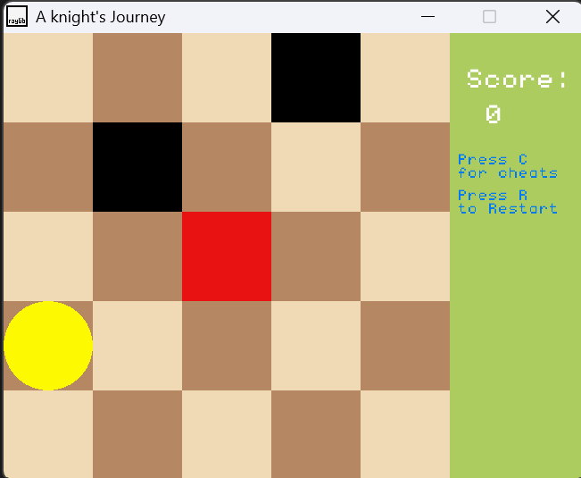

# Knight's Journey

Knight's Journey is a small 2D Game inspired by the knight in the game of Chess. 

The objective of the game is to get the knight to travel every tile in the 5x5 grid space.
It can't travel to a tile that's it already visited. 
Just like in the game of chess the knight can only move in a L shape. 

## Features: 
- Red tile represents the Knight.
- Black tile represents visited tile.
- White or Brown tiles are unvisited tiles.
- Score++ for every completed travel.
- Mini Chess Board interface. 
- Cheating Mechanic: Guides you the solution
- Reset 

## Controls: 
Movement uses only the the arrow keys. 
1. Hold Left, press Up: left three, one up
2. Hold Left, press Down: left three, one down
3. Hold Right, press Up: right three, one up
4. Hold Right, press Down: right three, one down
5. Hold Up, press Right: up three, right one 
6. Hold Up, press Left: up three, left one
7. Hold down, press Right: down three, right one
8. Hold down, press Left: down three, left one

9. Press r - Resets the board
10. Press c - Activates cheats; guides you to the solution

## Currently Working on:
UI Changes

## Future Improvements: 
- Add a 7x7 level.
- Add  graphics for the knight and visited tiles. 
